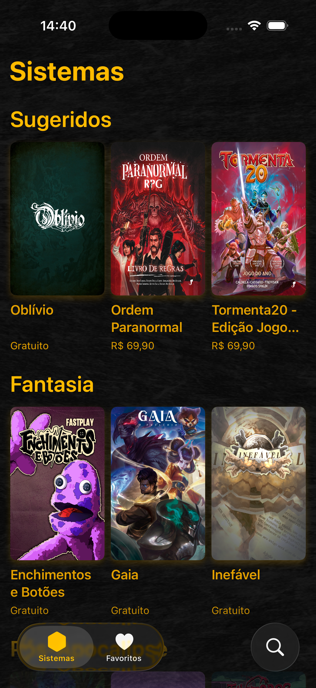
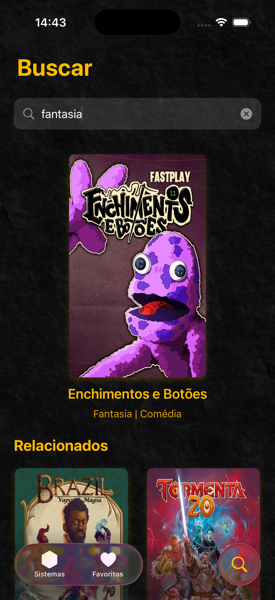
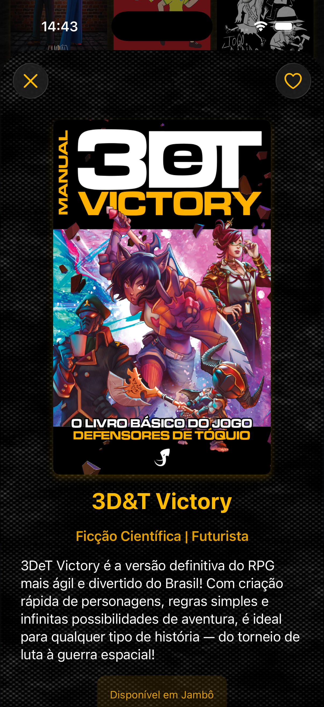
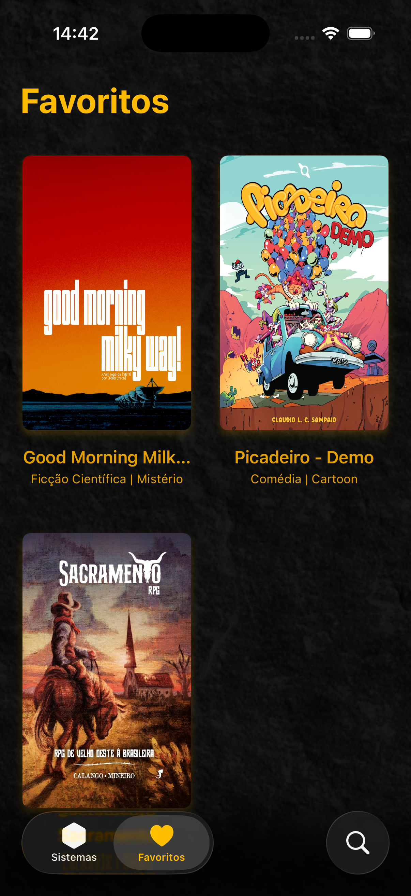

# MasterHand


<p align="center">
  
</p>

<h1 align="center">MasterHand</h1>

<p align="center">
  Catálogo interativo de sistemas de RPG brasileiros desenvolvido com SwiftUI, SwiftData e SQLite.
</p>

---

## 📖 Sobre o Projeto

O **MasterHand** é um aplicativo desenvolvido em **SwiftUI** que reúne diversos sistemas de RPG brasileiros em um catálogo organizado e intuitivo.

O projeto foi criado com o objetivo de facilitar a descoberta de sistemas de RPG através de categorias, sistema de busca inteligente, favoritos e uma interface moderna construída utilizando tecnologias nativas da Apple.

A persistência dos dados é realizada utilizando **SwiftData** integrado a um banco SQLite através do pacote **SwiftDataSQLite**.

---

## 📑 Índice

* Sobre o Projeto
* Ajustes e Melhorias
* Tecnologias Utilizadas
* Pré-requisitos
* Como Executar
* Como Utilizar
* Screenshots
* Estrutura do Projeto
* Equipe
* Licença

---

## 🛠️ Ajustes e Melhorias

### Funcionalidades concluídas

* [x] Splash Screen animada
* [x] Navegação por abas
* [x] Catálogo de sistemas RPG
* [x] Organização por categorias
* [x] Sistema de busca dinâmica
* [x] Tela de detalhes dos sistemas
* [x] Sistema de favoritos
* [x] Persistência local de dados
* [x] Integração com SQLite
* [x] Abertura de links externos
* [x] Interface desenvolvida com SwiftUI

### Melhorias futuras

* [ ] Compartilhamento de sistemas
* [ ] Sincronização em nuvem
* [ ] Novas categorias

---

## 💻 Pré-requisitos

Para executar o projeto você precisará de:

* macOS atualizado
* Xcode 15.0 ou superior
* Swift 5.9 ou superior
* iOS 17.0 ou superior

---

## 🧰 Tecnologias Utilizadas

### Linguagem

* Swift 5.9+

### Frameworks

* SwiftUI
* SwiftData

### Banco de Dados

* SQLite
* SwiftDataSQLite

### Ferramentas

* Xcode 15+
* Git
* GitHub

---

## 🚀 Como Executar o Projeto

### 1. Clone o repositório

```bash
git clone https://github.com/AngeloMatos08/MasterHand-IFCE-Foundation.git
```

### 2. Acesse o diretório

```bash
cd MasterHand-IFCE-Foundation
```

### 3. Abra o projeto

Abra o arquivo:

```text
MasterHand.xcodeproj
```

ou

```text
MasterHand.xcworkspace
```

caso exista.

### 4. Execute

* Selecione um simulador iOS
* Pressione ⌘ + R
* Aguarde a compilação

---

## ☕ Como Utilizar

### 📚 Explorar Sistemas

A tela inicial apresenta sistemas de RPG organizados por categorias.

### 🔍 Buscar

Utilize a aba de busca para pesquisar:

* Nome do sistema
* Categoria
* Palavra-chave

### ❤️ Favoritar

Adicione sistemas aos favoritos para encontrá-los rapidamente.

### 📖 Visualizar Detalhes

Cada sistema possui:

* Nome
* Categoria
* Descrição
* Informações adicionais
* Link oficial

---

## 📸 Screenshots

<div align="center">









</div>

---

## 👨‍🎓 Equipe do Projeto

<table>
<tr>

<td align="center">
<a href="https://github.com/AngeloMatos08">
<br>
<sub><b>Ângelo Matos</b></sub>
</a>
</td>

<td align="center">
<a href="<a href="https://github.com/AngeloMatos08">
<br>
<sub><b>Pedro Guimarães</b></sub>
</td>

<td align="center">
<a href="https://github.com/torilocode">
<br>
<sub><b>Henk Narciso</b></sub>
</a>
</td>

</tr>
</table>

---

## 🎯 Objetivo Acadêmico

Este projeto foi desenvolvido como atividade de aprendizado e prática dos conceitos de:

* SwiftUI
* Arquitetura de aplicativos iOS
* Persistência de dados
* SQLite
* SwiftData
* Boas práticas de desenvolvimento mobile

---

## 📄 Licença

Este projeto possui finalidade acadêmica e educacional.

Caso tenha interesse em contribuir, estudar ou reutilizar parte do código, entre em contato com os autores.

---

<p align="center">
Desenvolvido com ❤️ utilizando SwiftUI, SwiftData e SQLite.
</p>

